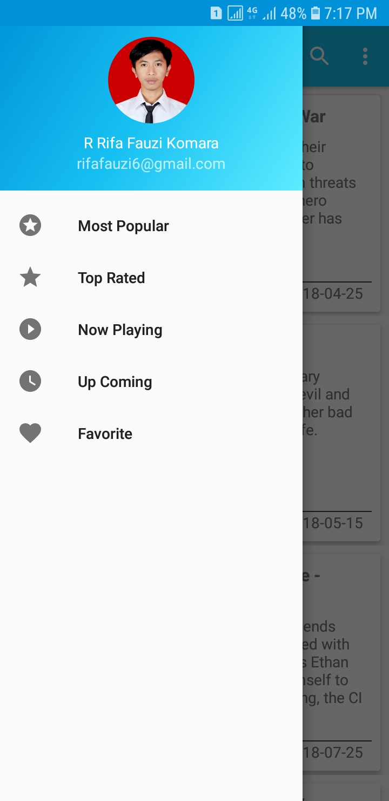
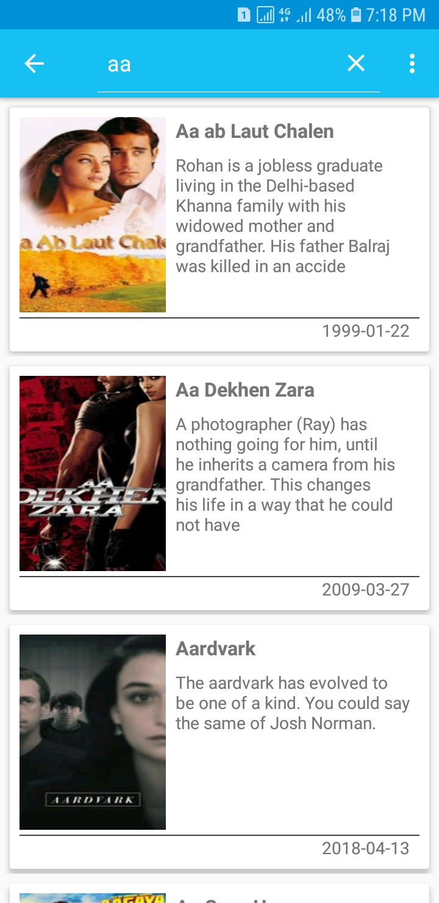
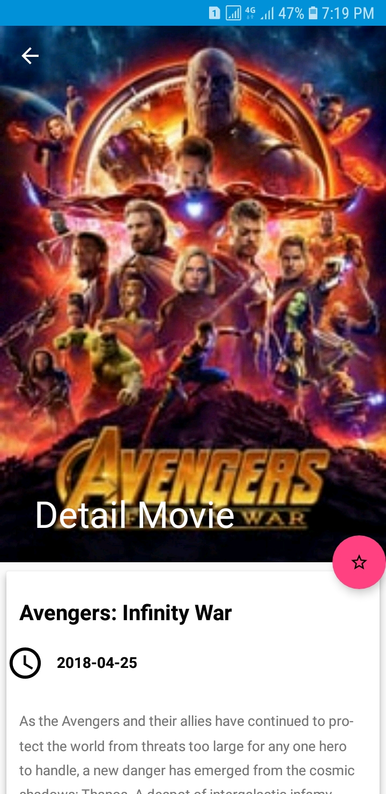
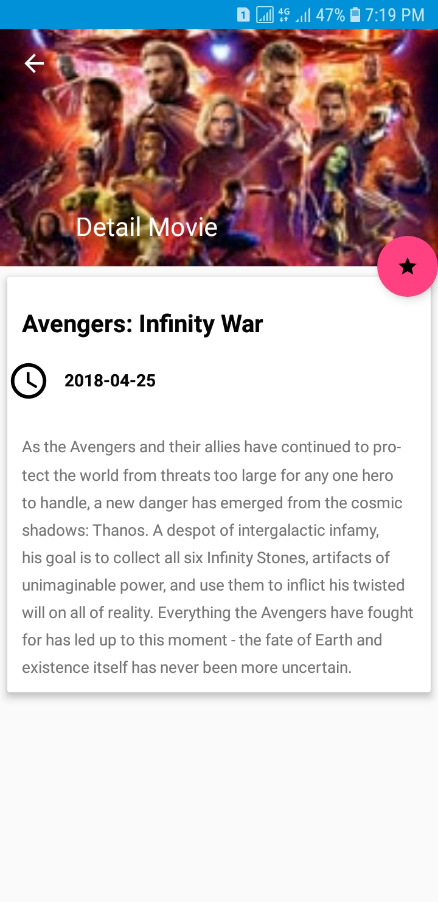
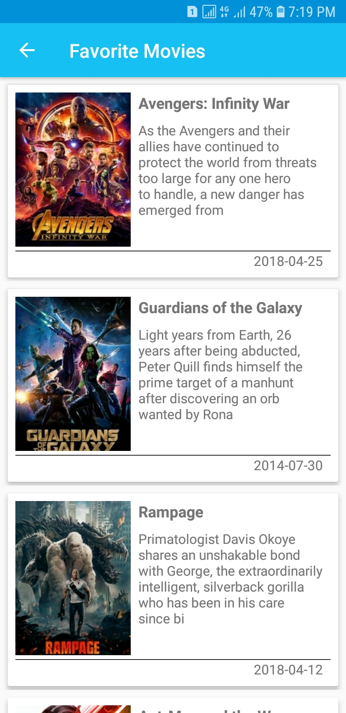
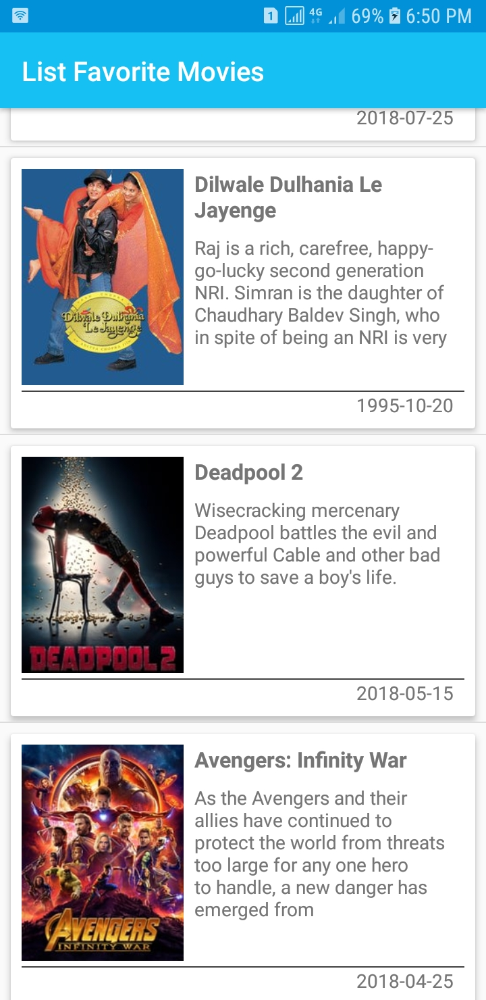

# Project Catalogue Movie Basis Data

Aplikasi katalog movie untuk submission keempat beasiswa MADE (Menjadi Android Developer Expert) dari Dicoding https://www.dicoding.com/academies/14/.

### Screenshots Aplikasi Pertama

<pre>
                                    
</pre>

### Screenshots Aplikasi Kedua (***New Module***)
<pre>
         
</pre>

### Persyaratan aplikasi

* [x] Tombol pada detail untuk menambahkan film favorit.
* [x] Halaman untuk menampilkan list movie favorit.
* [x] Menggunakan **contentprovider**.
* [x] Membuat aplikasi baru yaitu aplikasi favorit (boleh dengan menggunakan module baru) untuk mengakses list favorit.


### Petunjuk menjalankan source code aplikasi

Untuk menjalankan source code aplikasi ini, anda perlu registrasi API KEY dari www.themoviedb.org
kemudian memasukkan API KEY yang telah didapat ke dalam file ***gradle.properties***

```
MovieDbApiKey="Masukan API KEY anda disini"
```

Kemudian tambah baris berikut pada file ***build.gradle*** dibawah ***buildTypes***

```
buildTypes.each {
        it.buildConfigField 'String', 'MOVIE_DB_API_KEY', MovieDbApiKey
    }
```

## Author

* **R Rifa Fauzi Komara**

Jangan lupa untuk follow dan ★
